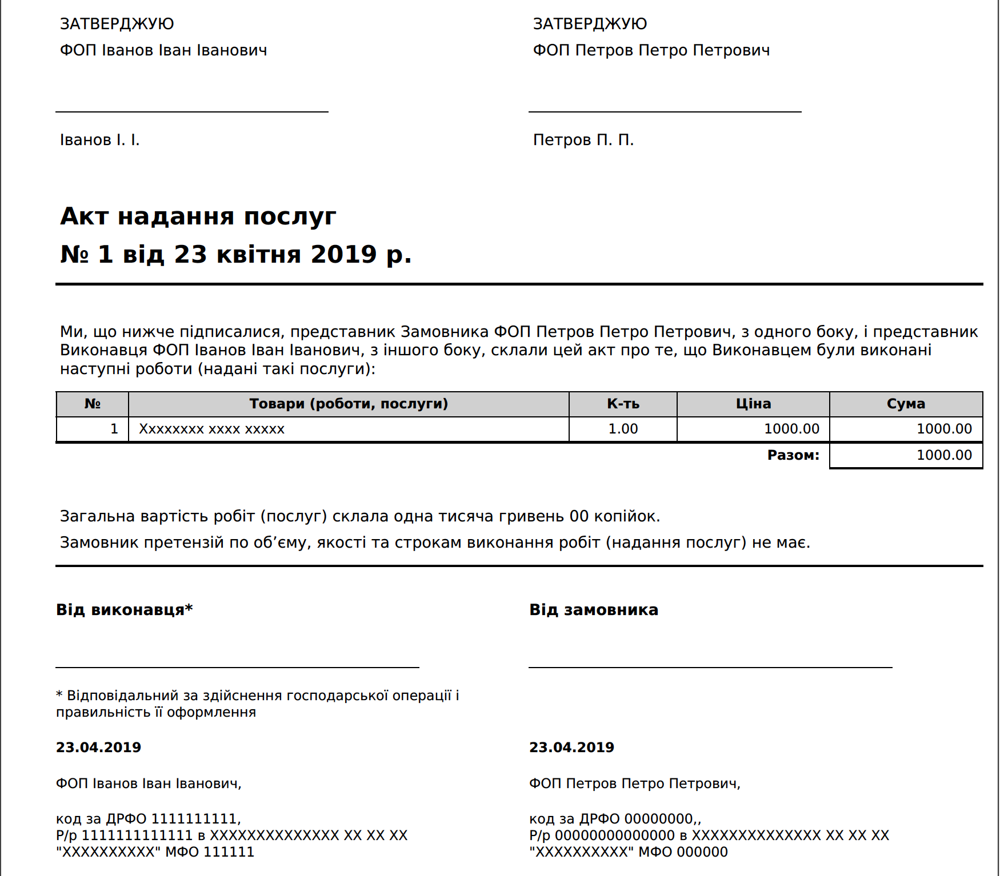
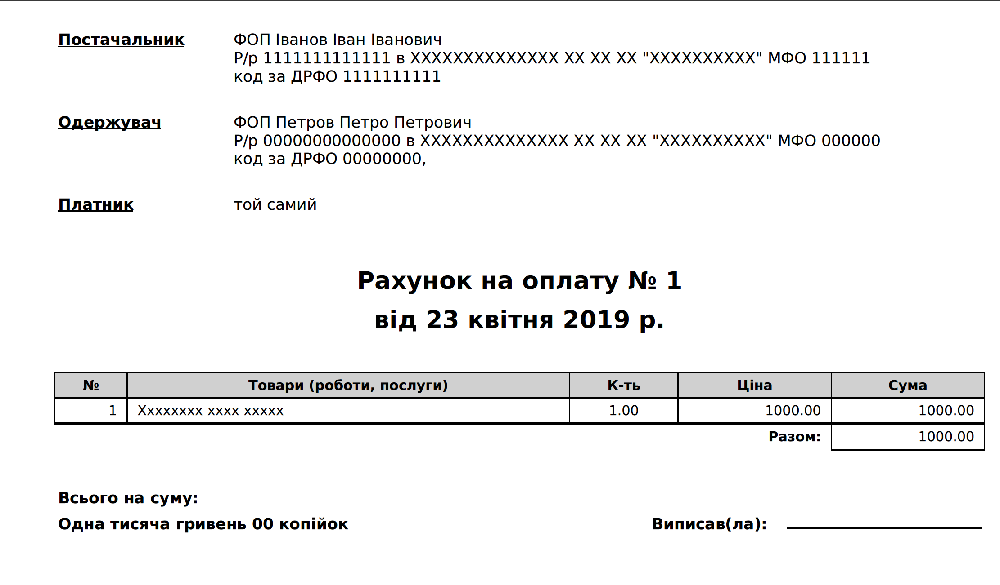

# Генерація Акту про надання послуг та Рахунку на оплату для ФОП

[![Go Report Card][1]][2]

[1]: https://goreportcard.com/badge/github.com/andreychuk/fop_docs
[2]: https://goreportcard.com/report/github.com/andreychuk/fop_docs

Акт надання послуг | Рахунок на оплату
----|-----
 | 


----

Генерування цих документів на основі *data.json* файлу. Структура данних наведенна в файлі *data_example.json*.

```json
{
  "provider": {
    "name": "ФОП Іванов Іван Іванович",
    "drfo": "1111111111",
    "rr": "1111111111111",
    "bank": "ХХХХХХХХХХХХХХ ХХ ХХ ХХ \"ХХХХХХХХХХ\"",
    "mfo": "111111",
    "person": "Іванов І. І."
  },
  "recipient": {
    "name": "ФОП Петров Петро Петрович",
    "drfo": "00000000,",
    "rr": "00000000000000",
    "bank": "ХХХХХХХХХХХХХХ ХХ ХХ ХХ \"ХХХХХХХХХХ\"",
    "mfo": "000000",
    "person": "Петров П. П."
  },
  "jobs": [
    {
      "job": "Хххххххх хххх ххххх",
      "quantity": 1.00,
      "price": 1000.00
    }
  ],
  "act": "1"
}
```

Використання
------------

```
docker run -i -v \
/path/to/report/folder:/src/reports:rw \
-v /path/to/data.json:/src/data.json \
andreychuk/fop_docs /fop_docs
```

за замовченням документи генеруються за поточну дату, але передавши `--signOn=YYYY-MM-DD` документи буде згенерованно за вказану дату.

License
-------

The MIT License (MIT), see [LICENSE](LICENSE).

Copyright (c) 2019 Ivan Andreychuk vandreychyk@gmail.com